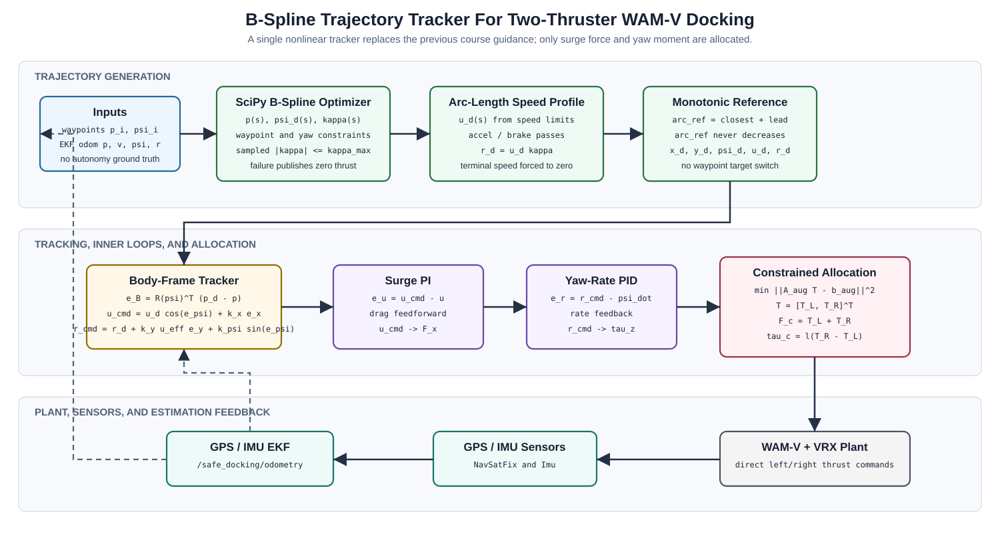

# Virtual RobotX (VRX)
This repository is the home to the source code and software documentation for the VRX simulation environment, which supports simulation of unmanned surface vehicles in marine environments.
* Designed in coordination with RobotX organizers, this project provides arenas and tasks similar to those featured in past and future RobotX competitions, as well as a description of the WAM-V platform.
* For RobotX competitors this simulation environment is intended as a first step toward developing tools prototyping solutions in advance of physical on-water testing.
* We also welcome users with simulation needs beyond RobotX. As we continue to improve the environment, we hope to offer support to a wide range of potential applications.

## Now supporting Gazebo Sim and ROS 2 by default
We're happy to announce with release 2.0 VRX has transitioned from Gazebo Classic to the newer Gazebo simulator (formerly [Ignition Gazebo](https://www.openrobotics.org/blog/2022/4/6/a-new-era-for-gazebo)). 
* Gazebo Garden and ROS 2 are now default prerequisites for VRX.
* This is the recommended configuration for new users.
* Users who wish to continue running Gazebo Classic and ROS 1 can still do so using the `gazebo_classic` branch of this repository. 
  * Tutorials for VRX Classic will remain available on our Wiki.
  * VRX Classic will transition from an officially supported branch to a community supported branch by Spring 2023.

## The VRX Competition
The VRX environment is also the "virtual venue" for the [VRX Competition](https://github.com/osrf/vrx/wiki). Please see our Wiki for tutorials and links to registration and documentation relevant to the virtual competition. 


## Getting Started

 * Watch the [Release 2.3 Highlight Video](https://vimeo.com/851696025).
 * The [VRX Wiki](https://github.com/osrf/vrx/wiki) provides documentation and tutorials.
 * The instructions assume a basic familiarity with the ROS environment and Gazebo.  If these tools are new to you, we recommend starting with the excellent [ROS Tutorials](http://wiki.ros.org/ROS/Tutorials)
 * For technical problems, please use the [project issue tracker](https://github.com/osrf/vrx/issues) to describe your problem or request support. 

## Safe Docking Quick Start

This branch adds a first safe-bay docking simulation milestone. The launch file
`vrx_gz/launch/safe_docking.launch.py` starts the `safe_docking_task` world,
spawns a WAM-V from `vrx_gz/config/safe_docking_wamv.yaml`, and can optionally
start RViz with `vrx_gz/config/safe_docking.rviz`.

On ROS 2 Humble, use the Gazebo Garden bridge packages. If these are not
available on the machine, ask an administrator to install:

```bash
sudo apt update
sudo apt install \
  ros-humble-ros-gzgarden-interfaces \
  ros-humble-ros-gzgarden-bridge \
  ros-humble-ros-gzgarden-sim \
  ros-humble-rviz2 \
  ros-humble-xacro \
  python3-sdformat13
```

Build from a shell using system Python, not a Conda Python environment. If the
prompt shows `(base)`, run `conda deactivate` first.

```bash
cd /home/zjy/vrx_docking
source /opt/ros/humble/setup.bash
colcon build --packages-up-to vrx_gz \
  --cmake-clean-cache \
  --event-handlers console_direct+ \
  --cmake-args -DPython3_EXECUTABLE=/usr/bin/python3
```

Launch the visual simulation. The extra `GZ_SIM_RESOURCE_PATH` entries let
Gazebo resolve WAM-V meshes from `model://wamv_description/...` and
`model://wamv_gazebo/...`.

```bash
cd /home/zjy/vrx_docking
source /opt/ros/humble/setup.bash
source install/setup.bash
export GZ_SIM_RESOURCE_PATH=$GZ_SIM_RESOURCE_PATH:$(pwd)/install/wamv_description/share:$(pwd)/install/wamv_gazebo/share

ros2 launch vrx_gz safe_docking.launch.py
```

To launch Gazebo and RViz together, enable the RViz launch argument. RViz starts
after a short delay and subscribes to the WAM-V camera and LiDAR topics.

```bash
ros2 launch vrx_gz safe_docking.launch.py launch_rviz:=True
```

For machines without working OpenGL / render-backed sensors, use the no-render
smoke-test configuration:

```bash
ros2 launch vrx_gz safe_docking.launch.py \
  headless:=True \
  config_file:=$(pwd)/install/vrx_gz/share/vrx_gz/config/safe_docking_wamv_norender.yaml
```

Inspect sensor topics from another sourced terminal:

```bash
ros2 topic list | grep sensor
ros2 topic hz /wamv/sensors/cameras/front_camera_sensor/optical/image_raw
ros2 topic hz /wamv/sensors/lidars/lidar_wamv_sensor/scan
ros2 topic hz /wamv/sensors/lidars/lidar_wamv_sensor/points
```

Use `Ctrl-C` to stop launches cleanly. Avoid `Ctrl-Z`, which only suspends the
launch and can leave old Gazebo / bridge processes around.

### Safe Docking Notes From 2026-05-28

- Verified the branch builds on Ubuntu 22.04 / ROS 2 Humble with Gazebo Garden
  bridge packages and `python3-sdformat13`.
- Confirmed the safe docking world reaches `ScoringPlugin::OnRunning`, starts
  dock bay detector topics, and spawns WAM-V with camera, LiDAR, GPS, IMU, and
  thruster bridges.
- Extended the safe docking task running duration from 300 seconds to 3600
  seconds.
- Added `launch_rviz:=True` and a safe docking RViz config using the active ROS
  sensor topics under `/wamv/sensors/...`.
- Added and verified a GPS/IMU planar inertial EKF state estimator. State
  estimation is achieved for the current simulation baseline.
- Added and verified a first path-guided cascaded PID controller for the
  two-thruster WAM-V. Perception and planning are still intentionally not
  implemented.

## USV Dynamics Model For Safe Docking

For the first autonomy baseline, model the WAM-V as a planar 3-DOF surface
vehicle in the local ENU frame. The local frame origin should initially be the
first valid GPS fix:

```text
x: East position in meters
y: North position in meters
psi: yaw angle in radians
```

Use the local-frame state:

$$
x_{\mathrm{state}} =
\begin{bmatrix}
x & y & \psi & \dot{x} & \dot{y} & \dot{\psi}
\end{bmatrix}^{T}
$$

The control input is the left and right thruster force command. In the current
Gazebo setup these commands are published directly as thrust forces in Newtons:

$$
T =
\begin{bmatrix}
T_L & T_R
\end{bmatrix}^{T}
$$

### Kinematics

The first three equations are directly from the state definition:

$$
\dot{x}_{\mathrm{state}} =
\begin{bmatrix}
\dot{x} & \dot{y} & \dot{\psi} & \ddot{x} & \ddot{y} & \ddot{\psi}
\end{bmatrix}^{T}
$$

Define the body-to-local yaw rotation:

$$
R(\psi) =
\begin{bmatrix}
\cos\psi & -\sin\psi \\
\sin\psi & \cos\psi
\end{bmatrix}
$$

The local linear velocity can be converted into body-frame surge and sway
velocity for hydrodynamic damping:

$$
\begin{aligned}
\left[
\begin{array}{c}
u \\
v
\end{array}
\right]
&=
R(\psi)^{T}
\left[
\begin{array}{c}
\dot{x} \\
\dot{y}
\end{array}
\right]
\end{aligned}
$$

$$
u = \dot{x}\cos\psi + \dot{y}\sin\psi
$$

$$
v = -\dot{x}\sin\psi + \dot{y}\cos\psi
$$

### Thruster Allocation

Assume two fixed aft thrusters, no lateral thruster, and symmetric spacing.
Let `b` be the lateral distance between the two thrusters and `l = b / 2`.

$$
\begin{aligned}
\left[
\begin{array}{c}
F_x \\
F_y \\
\tau_z
\end{array}
\right]
&=
B(\psi)
\left[
\begin{array}{c}
T_L \\
T_R
\end{array}
\right]
\end{aligned}
$$

$$
B(\psi) =
\begin{bmatrix}
\cos\psi & \cos\psi \\
\sin\psi & \sin\psi \\
-l & l
\end{bmatrix}
$$

Therefore:

$$
F_x = (T_L + T_R)\cos\psi
$$

$$
F_y = (T_L + T_R)\sin\psi
$$

$$
\tau_z = l(T_R - T_L)
$$

`F_x` and `F_y` are local-frame force components. `tau_z` is the yaw torque
about the local up axis. Because `B(psi)` is `3 x 2`, the WAM-V with two fixed
aft thrusters is underactuated: it cannot command arbitrary `F_x`, `F_y`, and
`tau_z` independently.

### Damping

Hydrodynamic damping is most naturally modeled in the vessel body frame because
water resistance depends on motion relative to the hull:

$$
F_{D,\mathrm{body}} =
\begin{bmatrix}
-(d_u + d_{uu}|u|)u \\
-(d_v + d_{vv}|v|)v
\end{bmatrix}
$$

Rotate it back into the local frame:

$$
F_{D,\mathrm{local}} = R(\psi)F_{D,\mathrm{body}}
$$

Expanded:

$$
\begin{aligned}
F_{D,x}
&=
-\cos\psi(d_u + d_{uu}|u|)u
+\sin\psi(d_v + d_{vv}|v|)v
\end{aligned}
$$

$$
\begin{aligned}
F_{D,y}
&=
-\sin\psi(d_u + d_{uu}|u|)u
-\cos\psi(d_v + d_{vv}|v|)v
\end{aligned}
$$

Yaw damping is:

$$
\tau_{D,z} = -(d_r + d_{rr}|\dot{\psi}|)\dot{\psi}
$$

### Rotation Simplification

The body angular velocity relative to the local frame can be written as:

$$
\omega_{BW} = p\,x_b + q\,y_b + r\,z_b
$$

For planar docking:

$$
p = 0,\quad q = 0,\quad r = \dot{\psi}
$$

$$
\omega_{BW} = \dot{\psi}\,z_b
$$

The full rigid-body rotational equation is:

$$
\tau = I\dot{\omega} + \omega \times (I\omega)
$$

For yaw-only motion and a body inertia tensor aligned with the principal axes,
`omega_BW` and `I * omega_BW` are parallel, so:

$$
\omega_{BW} \times (I\omega_{BW}) = 0
$$

Therefore the yaw equation reduces to:

$$
I_z\ddot{\psi} = \tau_z + \tau_{D,z}
$$

### Local-Frame Dynamics

The complete dynamics are:

$$
\frac{dx}{dt} = \dot{x}
$$

$$
\frac{dy}{dt} = \dot{y}
$$

$$
\frac{d\psi}{dt} = \dot{\psi}
$$

$$
\begin{aligned}
\ddot{x}
&=
\frac{
(T_L + T_R)\cos\psi
-\cos\psi(d_u + d_{uu}|u|)u
+\sin\psi(d_v + d_{vv}|v|)v
}{m}
\end{aligned}
$$

$$
\begin{aligned}
\ddot{y}
&=
\frac{
(T_L + T_R)\sin\psi
-\sin\psi(d_u + d_{uu}|u|)u
-\cos\psi(d_v + d_{vv}|v|)v
}{m}
\end{aligned}
$$

$$
\begin{aligned}
\ddot{\psi}
&=
\frac{
l(T_R - T_L)
-(d_r + d_{rr}|\dot{\psi}|)\dot{\psi}
}{I_z}
\end{aligned}
$$

with:

$$
u = \dot{x}\cos\psi + \dot{y}\sin\psi
$$

$$
v = -\dot{x}\sin\psi + \dot{y}\cos\psi
$$

The corresponding matrix form is:

$$
\begin{aligned}
\frac{d}{dt}
\left[
\begin{array}{c}
x \\
y \\
\psi \\
\dot{x} \\
\dot{y} \\
\dot{\psi}
\end{array}
\right]
&=
\left[
\begin{array}{c}
\dot{x} \\
\dot{y} \\
\dot{\psi} \\
(F_x + F_{D,x})/m \\
(F_y + F_{D,y})/m \\
(\tau_z + \tau_{D,z})/I_z
\end{array}
\right]
\end{aligned}
$$

For the current VRX WAM-V simulation, reasonable baseline parameters from the
model files are:

| Parameter | Value |
| --- | ---: |
| $m$ | 180.0 |
| $I_z$ | 446.0 |
| $d_u$ | 100.0 |
| $d_{uu}$ | 150.0 |
| $d_v$ | 100.0 |
| $d_{vv}$ | 100.0 |
| $d_r$ | 800.0 |
| $d_{rr}$ | 800.0 |

These values are suitable for first controller and estimator development, but
payloads and fitted simulator behavior may shift the effective mass, inertia,
and damping. Re-identify the parameters from simulation data before relying on
high-accuracy prediction.

## GPS / IMU EKF State Estimator

The initial state estimator lives in `robotx_safe_docking_estimation`. It uses a
planar inertial EKF with GPS position updates and IMU yaw as a compass / AHRS
placeholder. The internal EKF state is:

$$
x_{\mathrm{ekf}} =
\begin{bmatrix}
x & y & \psi & \dot{x} & \dot{y} & b_{ax} & b_{ay} & b_{gz}
\end{bmatrix}^{T}
$$

where `b_ax` and `b_ay` are body-frame accelerometer biases and `b_gz` is the
gyro-z bias. The published controller-facing state is:

$$
x_{\mathrm{pub}} =
\begin{bmatrix}
x & y & \psi & \dot{x} & \dot{y} & \dot{\psi}
\end{bmatrix}^{T}
$$

with $\dot{\psi} = \omega_{z,m} - b_{gz}$.

At startup, the estimator holds initialization while it collects a short batch
of GPS fixes. The averaged GPS fix defines the local ENU origin. For the small
VRX task area, GPS is converted to local meters with an equirectangular WGS84
approximation:

$$
x = (\mathrm{lon} - \mathrm{lon}_0)\cos(\mathrm{lat}_0)R_e
$$

$$
y = (\mathrm{lat} - \mathrm{lat}_0)R_e
$$

where `R_e = 6378137.0 m`.

The estimator publishes the WAM-V reference point, not the GPS antenna point.
The safe docking WAM-V GPS is mounted at `[-0.85, 0.0]` m in the body frame, so
GPS position measurements are corrected for the yaw-dependent lever arm:

$$
\begin{aligned}
r_{\mathrm{gpsB}}
&=
\left[
\begin{array}{c}
x_{\mathrm{gpsBody}} \\
y_{\mathrm{gpsBody}}
\end{array}
\right]
\end{aligned}
$$

$$
\begin{aligned}
z_{\mathrm{base}}
&=
z_{\mathrm{gpsDelta}}
- R(\psi)r_{\mathrm{gpsB}}
+ R(\psi_0)r_{\mathrm{gpsB}}
\end{aligned}
$$

where `psi_0` is the first IMU yaw used by the estimator, and
$x_{\mathrm{gpsBody}}$, $y_{\mathrm{gpsBody}}$ are the configured
`gps_body_x`, `gps_body_y` offsets.

The EKF prediction uses body-frame IMU linear acceleration and yaw rate:

$$
a_B =
\begin{bmatrix}
a_{x,m} - b_{ax} \\
a_{y,m} - b_{ay}
\end{bmatrix}
$$

$$
R(\psi) =
\begin{bmatrix}
\cos\psi & -\sin\psi \\
\sin\psi & \cos\psi
\end{bmatrix}
$$

$$
a_W = R(\psi)a_B
$$

$$
\omega = \omega_{z,m} - b_{gz}
$$

$$
x_{k+1} = x_k + \dot{x}_k\Delta t + \frac{1}{2}a_{W,x}\Delta t^2
$$

$$
y_{k+1} = y_k + \dot{y}_k\Delta t + \frac{1}{2}a_{W,y}\Delta t^2
$$

$$
\psi_{k+1} = \mathrm{wrap}(\psi_k + \omega\Delta t)
$$

$$
\dot{x}_{k+1} = \dot{x}_k + a_{W,x}\Delta t
$$

$$
\dot{y}_{k+1} = \dot{y}_k + a_{W,y}\Delta t
$$

$$
b_{ax,k+1} = b_{ax,k},\quad
b_{ay,k+1} = b_{ay,k},\quad
b_{gz,k+1} = b_{gz,k}
$$

GPS measurement update:

$$
z_{\mathrm{gps}} =
\begin{bmatrix}
x_{\mathrm{gps}} \\
y_{\mathrm{gps}}
\end{bmatrix}
$$

$$
h_{\mathrm{gps}}(x_{\mathrm{ekf}}) =
\begin{bmatrix}
x \\
y
\end{bmatrix}
$$

IMU yaw measurement update. In simulation this comes from
`sensor_msgs/msg/Imu.orientation`; in the real system it is intended to stand in
for a future compass, AHRS, INS, or dual-RTK heading source:

$$
z_{\mathrm{imu,yaw}} = \psi_{\mathrm{imu}}
$$

$$
h_{\mathrm{imu,yaw}}(x_{\mathrm{ekf}}) = \psi
$$

The gyro-z value is not double-counted as a separate measurement in the current
filter. It is used as the prediction input, and the published yaw rate is
$\dot{\psi} = \omega_{z,m} - b_{gz}$.

Current EKF parameters are:

```text
use_imu_orientation: true
use_gps_velocity_measurement: true

gps_body_x: -0.85
gps_body_y: 0.0

origin_init_duration_sec: 5.0
origin_min_samples: 20
origin_max_std_m: 0.5

gps_position_variance: 0.01
gps_velocity_variance: 0.05
imu_yaw_variance: 0.02
acceleration_noise_variance: 0.25
gyro_noise_variance: 0.0004
yaw_process_variance: 0.01
accel_bias_random_walk_variance: 0.0004
gyro_bias_random_walk_variance: 0.000001
unmodeled_velocity_process_variance: 0.05
```

Launch the estimator after the safe docking simulation is running:

```bash
source /opt/ros/humble/setup.bash
source install/setup.bash

ros2 launch robotx_safe_docking_estimation estimator.launch.py
```

For development-only RMSE reporting against Gazebo pose ground truth:

```bash
ros2 launch robotx_safe_docking_estimation estimator.launch.py verify:=True
```

The verifier expects the debug ground-truth odometry topic:

```text
/wamv/sensors/position/ground_truth_odometry
```

That topic is only available when the WAM-V xacro argument
`ground_truth_enabled:=true` is used. Keep this disabled for normal autonomy
runs; enable it only in temporary verification configs or evaluator code.

The estimator publishes:

```text
/safe_docking/state     std_msgs/msg/Float64MultiArray
/safe_docking/odometry  nav_msgs/msg/Odometry
```

`/safe_docking/state` publishes the six controller-facing states followed by the
three bias estimates:

```text
[x, y, psi, x_dot, y_dot, psi_dot, b_ax, b_ay, b_gz]
```

The verifier subscribes to Gazebo pose ground truth only for offline/debug
performance reporting. Autonomy nodes must consume `/safe_docking/state` or
`/safe_docking/odometry`, not Gazebo pose or evaluator topics.

The current verified baseline used a short open-loop maneuver: about 10 seconds
of straight thrust (`T_L = 80 N`, `T_R = 80 N`) followed by about 10 seconds of
turning thrust (`T_L = 40 N`, `T_R = 120 N`). Against debug ground truth, the
lever-arm-compensated EKF achieved:

```text
samples: 4190
duration_s: 35.196

metric,rmse,mae,max_abs
x,0.033476,0.030465,0.089608
y,0.040380,0.031415,0.092828
psi,0.002228,0.001464,0.007272
x_dot,0.020328,0.017419,0.049187
y_dot,0.011758,0.009380,0.033439
psi_dot,0.009176,0.007324,0.032530
```

## Cascaded PID Controller Design

The current controller is the path-guided cascaded PID implementation in
`robotx_safe_docking_control`. It is intentionally underactuated: the WAM-V has
only two fixed aft thrusters, so the controller commands body-frame surge force
and yaw moment, not arbitrary local-frame lateral force. Lateral path error is
handled by changing the desired course / yaw command.

The controller framework is shown below. The figure is committed as SVG so the
block diagram remains visible on GitHub even when Markdown math preview is not
available.



The implemented data flow is:

```text
EKF odometry + yaw-specified waypoints
  -> quintic Hermite path generator and curvature feasibility check
  -> monotonic lookahead reference lookup
  -> along-track / cross-track sqrt-P path guidance
  -> body-frame surge PI and yaw-rate PID
  -> weighted constrained left/right thrust allocation
  -> WAM-V thrusters
```

### Path Generation

For each path segment, the controller uses a quintic Hermite curve
parameterized by $s \in [0, 1]$:

$$
p(s)=a_0+a_1s+a_2s^2+a_3s^3+a_4s^4+a_5s^5
$$

The endpoint constraints are:

$$
p(0)=p_0,\quad p(1)=p_f
$$

$$
p_s(0)=d_0
\begin{bmatrix}
\cos\psi_0 \\
\sin\psi_0
\end{bmatrix},
\quad
p_s(1)=d_f
\begin{bmatrix}
\cos\psi_f \\
\sin\psi_f
\end{bmatrix}
$$

$$
p_{ss}(0)=d_0^2\kappa_0
\begin{bmatrix}
-\sin\psi_0 \\
\cos\psi_0
\end{bmatrix},
\quad
p_{ss}(1)=0
$$

The curvature of the generated curve is:

$$
\kappa(s)=
\frac{p_{s,x}(s)p_{ss,y}(s)-p_{s,y}(s)p_{ss,x}(s)}
{\left\lVert p_s(s)\right\rVert^3}
$$

The current curvature feasibility pass samples the whole generated path and
checks:

$$
\max_s |\kappa(s)| \le \kappa_{\max}
$$

If the sampled path is too sharp, the controller increases the Hermite tangent
handle lengths and regenerates the path. If the path is still too sharp after
the configured smoothing attempts, it keeps the least-sharp candidate and
reports the waypoint / yaw set as infeasible. This separates path-design
feasibility from controller tracking quality.

Waypoint 1 is an intermediate path constraint, not a controller target switch.
The reference lookup uses a monotonic arc-length cursor:

$$
\begin{aligned}
s_{\mathrm{ref},k}
&=
\operatorname{arc}^{-1}
\left(
\max\left(
\operatorname{arc}_{\mathrm{closest}}+\ell_{\mathrm{lookahead}},
\operatorname{arc}_{\mathrm{ref},k-1}
\right)
\right)
\end{aligned}
$$

This prevents the reference point from jumping backward along the path.

### Path Guidance

At the selected reference point:

$$
t_{\mathrm{ref}} =
\frac{p_s(s_{\mathrm{ref}})}
{\left\lVert p_s(s_{\mathrm{ref}})\right\rVert},
\quad
n_{\mathrm{ref}} =
\begin{bmatrix}
-t_{\mathrm{ref},y} \\
t_{\mathrm{ref},x}
\end{bmatrix}
$$

$$
e_p=p_{\mathrm{ref}}-p,\quad
e_s=t_{\mathrm{ref}}^T e_p,\quad
e_y=n_{\mathrm{ref}}^T e_p
$$

The controller uses a square-root proportional function for bounded approach
speed:

$$
\operatorname{sqrtP}(e;k,a_{\max})=
\begin{cases}
ke, & |e|\le a_{\max}/k^2 \\
\operatorname{sgn}(e)
\sqrt{2a_{\max}\left(|e|-\frac{a_{\max}}{2k^2}\right)},
& |e|>a_{\max}/k^2
\end{cases}
$$

The curvature and stopping-distance speed limits are:

$$
u_{\kappa} =
\sqrt{
\frac{a_{\mathrm{lat},\max}}
{\max\left(|\kappa_{\mathrm{ref}}|,\epsilon_{\kappa}\right)}
}
$$

$$
u_{\mathrm{stop}}=
\sqrt{2a_{\mathrm{stop},\max}d_{\mathrm{goal}}}
$$

$$
u_{\mathrm{path}}=
\min\left(
u_{\mathrm{cruise}},
u_{\kappa},
u_{\mathrm{stop}},
u_{\max}
\right)
$$

The desired body-frame surge speed is:

$$
u_{\mathrm{ref}} =
\operatorname{sat}_{[u_{\min},u_{\max}]}
\left(
u_{\mathrm{path}}
+\operatorname{sqrtP}
\left(e_s;k_s,a_{s,\max}\right)
\right)
$$

The cross-track correction is converted into course angle, not lateral force:

$$
v_{\perp,\mathrm{cmd}} =
\operatorname{sat}_{[-v_{\perp,\max},v_{\perp,\max}]}
\left(
\operatorname{sqrtP}
\left(e_y;k_y,a_{y,\max}\right)
\right)
$$

$$
\Delta\chi =
\operatorname{sat}_{[-\Delta\chi_{\max},\Delta\chi_{\max}]}
\left(
\operatorname{atan2}
\left(
v_{\perp,\mathrm{cmd}},
\max(|u_{\mathrm{ref}}|,u_{\mathrm{guidance},\min})
\right)
\right)
$$

Near the final waypoint, cross-track correction is faded out so the terminal
yaw has priority:

$$
w_{\psi}=
\operatorname{sat}_{[0,1]}
\left(
\frac{d_{\mathrm{goal}}}{d_{\mathrm{blend}}}
\right),
\quad
\chi_{\mathrm{cmd}}=
\operatorname{wrap}
\left(
\psi_{\mathrm{ref}}+w_{\psi}\Delta\chi
\right)
$$

Sideslip compensation is disabled by default. With the default setting:

$$
\psi_{\mathrm{cmd}}=\chi_{\mathrm{cmd}}
$$

The desired yaw rate is:

$$
r_{\mathrm{ff}}=
\operatorname{sat}_{[-r_{\mathrm{ff},\max},r_{\mathrm{ff},\max}]}
\left(
u_{\mathrm{ref}}\kappa_{\mathrm{ref}}
\right)
$$

$$
e_{\psi}=\operatorname{wrap}(\psi_{\mathrm{cmd}}-\psi)
$$

$$
r_{\mathrm{fb}}=
\operatorname{sqrtP}
\left(
e_{\psi};
k_{\psi},
a_{\psi,\max}
\right)
$$

$$
r_{\mathrm{ref}}=
\operatorname{sat}_{[-r_{\max},r_{\max}]}
\left(
r_{\mathrm{ff}}+r_{\mathrm{fb}}
\right)
$$

### Surge And Yaw Loops

The EKF publishes local-frame velocity. The controller converts it to
body-frame velocity:

$$
\begin{aligned}
\left[
\begin{array}{c}
u \\
v
\end{array}
\right]
&=
R(\psi)^T
\left[
\begin{array}{c}
\dot{x} \\
\dot{y}
\end{array}
\right]
\end{aligned}
$$

Only the surge component $u$ is controlled directly. The surge speed error is:

$$
e_u = u_{\mathrm{ref}}-u
$$

The feed-forward drag compensation used by the implemented controller is:

$$
F_{\mathrm{drag,ff}} =
d_{u,1}u_{\mathrm{ref}}
+d_{u,2}|u_{\mathrm{ref}}|u_{\mathrm{ref}}
$$

The commanded surge force is:

$$
F_{\parallel,d} =
\operatorname{sat}_{[-F_{\parallel,\max},F_{\parallel,\max}]}
\left(
F_{\mathrm{drag,ff}}
+K_{p,u}e_u
+K_{i,u}\int e_u\,dt
\right)
$$

The yaw-rate error is:

$$
e_r=r_{\mathrm{ref}}-\dot{\psi}
$$

The commanded yaw moment is:

$$
\tau_d =
\operatorname{sat}_{[-\tau_{\max},\tau_{\max}]}
\left(
K_{p,r}e_r
+K_{i,r}\int e_r\,dt
+K_{d,r}\frac{de_r}{dt}
\right)
$$

The integrators use anti-windup: each integral is updated only when the
allocated thrust can approximately realize the requested surge force or yaw
moment.

### Constrained Thrust Allocation

Let $l$ be the half-spacing between the two aft thrusters. The allocation
matrix is:

$$
A=
\begin{bmatrix}
1 & 1 \\
-l & l
\end{bmatrix}
$$

$$
y_d=
\begin{bmatrix}
F_{\parallel,d} \\
\tau_d
\end{bmatrix},
\quad
T=
\begin{bmatrix}
T_L \\
T_R
\end{bmatrix}
$$

The implemented weighted least-squares problem also penalizes thrust jumps:

$$
A_{\mathrm{aug}}=
\begin{bmatrix}
\sqrt{w_F} & \sqrt{w_F} \\
-l\sqrt{w_{\tau}} & l\sqrt{w_{\tau}} \\
\sqrt{w_s} & 0 \\
0 & \sqrt{w_s}
\end{bmatrix}
$$

$$
b_{\mathrm{aug}}=
\begin{bmatrix}
\sqrt{w_F}F_{\parallel,d} \\
\sqrt{w_{\tau}}\tau_d \\
\sqrt{w_s}T_{L,\mathrm{prev}} \\
\sqrt{w_s}T_{R,\mathrm{prev}}
\end{bmatrix}
$$

$$
T^*=
\arg\min_T
\left\lVert
A_{\mathrm{aug}}T-b_{\mathrm{aug}}
\right\rVert^2
$$

subject to:

$$
T_{\min}\le T_L\le T_{\max},
\quad
T_{\min}\le T_R\le T_{\max}
$$

$$
|T_L-T_{L,\mathrm{prev}}|
\le
\dot{T}_{\max}\Delta t,
\quad
|T_R-T_{R,\mathrm{prev}}|
\le
\dot{T}_{\max}\Delta t
$$

The realized commands are:

$$
F_{\parallel,c}=T_L+T_R
$$

$$
\tau_c=l(T_R-T_L)
$$

The controller uses $w_{\tau}>w_F$, so yaw alignment is prioritized when the
two thrusters cannot satisfy surge and yaw simultaneously.

### Implemented Controller

Launch the controller after the safe docking simulation and estimator are
running:

```bash
ros2 launch robotx_safe_docking_control controller.launch.py
```

It subscribes to the EKF odometry on `/safe_docking/odometry` and publishes
direct thrust commands on:

```text
/wamv/thrusters/left/thrust
/wamv/thrusters/right/thrust
```

The default two-waypoint path in the estimator local frame is:

| Waypoint | x (m) | y (m) | yaw (rad) | Role |
| --- | ---: | ---: | ---: | --- |
| 1 | 4.0 | 8.0 | 1.0 | Intermediate path constraint |
| 2 | 6.0 | 12.0 | 2.4 | Final target |

The tuned command limits are intentionally conservative for this first
baseline:

| Parameter | Value |
| --- | ---: |
| `u_cruise` | 0.65 m/s |
| `u_min` | -0.25 m/s |
| `u_max` | 0.75 m/s |
| `F_parallel,max` | 650 N |
| `tau_max` | 1300 N m |
| `T_min` | -500 N |
| `T_max` | 500 N |
| `r_max` | 0.8 rad/s |
| `kappa_max` | 0.7 1/m |

The latest headless verification used the EKF estimate for feedback and
Gazebo ground-truth odometry only for offline scoring. The recorder aligns
ground truth into the EKF local frame before computing target errors. Artifacts
are saved in
`output/controller_pid/curvature_checked_path/`.

The latest run used the curvature-checked two-waypoint path with final
$\psi_d=2.4$ rad:

| Metric | Value |
| --- | ---: |
| estimate final distance | 0.191 m |
| estimate minimum distance | 0.125 m |
| estimate final yaw error | 0.0427 rad |
| truth final distance | 0.174 m |
| truth minimum distance | 0.0785 m |
| truth final yaw error | 0.0429 rad |
| path max absolute curvature | 1.788 1/m |
| path curvature limit | 0.700 1/m |
| path smoothing attempts | 2 |
| path curvature feasible | false |

The result supports our current interpretation: the controller tracks the
generated reference well enough for a first baseline, but this waypoint / yaw
combination violates the configured path curvature limit. That should be fixed
by path generation or planning rather than by forcing the controller to hide a
geometrically sharp reference.

The controller itself does not consume ground truth.

Future safe-way planning should replace the current handle-scaling feasibility
pass with an optimization-based spline path that directly constrains curvature,
obstacle clearance, and smoothness. That will matter once the planner produces
waypoints around docks, buoys, blocked water, or other vessels.

## Reference

If you use the VRX simulation in your work, please cite our summary publication, [Toward Maritime Robotic Simulation in Gazebo](https://wiki.nps.edu/display/BB/Publications?preview=/1173263776/1173263778/PID6131719.pdf): 

```
@InProceedings{bingham19toward,
  Title                    = {Toward Maritime Robotic Simulation in Gazebo},
  Author                   = {Brian Bingham and Carlos Aguero and Michael McCarrin and Joseph Klamo and Joshua Malia and Kevin Allen and Tyler Lum and Marshall Rawson and Rumman Waqar},
  Booktitle                = {Proceedings of MTS/IEEE OCEANS Conference},
  Year                     = {2019},
  Address                  = {Seattle, WA},
  Month                    = {October}
}
```

## Contributing
This project is under active development to support the VRX and RobotX teams. We are adding and improving things all the time. Our primary focus is to provide the fundamental aspects of the robot and environment, but we rely on the community to develop additional functionality around their particular use cases.

If you have any questions about these topics, or would like to work on other aspects, please contribute.  You can contact us directly (see below), submit an [issue](https://github.com/osrf/vrx/issues) or, better yet, submit a [pull request](https://github.com/osrf/vrx/pulls/)!

## Contributors

We continue to receive important improvements from the community.  We have done our best to document this on our [Contributors Wiki](https://github.com/osrf/vrx/wiki/Contributors).

## Contacts

 * Carlos Agüero <caguero@openrobotics.org>
 * Michael McCarrin <mrmccarr@nps.edu>
 * Brian Bingham <bbingham@nps.edu>
